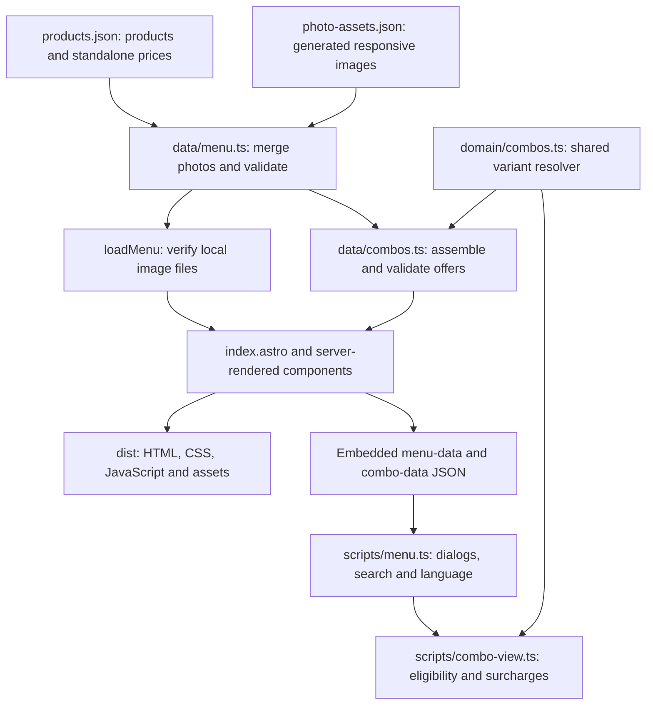
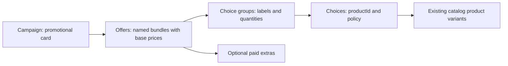

# Cà Zone website architecture

Live architecture document. Last verified: 2026-09-13. Update this file in the same change as any architectural or behavioral change. It describes the current working tree; deployment status is separate.

Start with [Pricing rules](PRICING_RULES.md) for business meaning and [Current pricing reference](CURRENT_PRICING.md) for the exact configured amounts and eligible variants. [Documentation index](README.md) links the editing guides.

## Purpose and scope

The site is a bilingual, static reference menu for Cà Zone. Customers browse products, prices, options, benefits, and combos, then order at the counter. The current snapshot has 9 categories, 50 products, 68 product variants, 4 promotional cards, and 8 underlying combo offers.

It runs locally without a domain, backend, database, external font service, or Cloudflare account. Domain purchase and Cloudflare setup are deferred. The generated page declares `noindex, nofollow` for review. It has no cart, selected-item total, payment, order API, POS integration, live inventory, CMS, promotion scheduling, or per-location price list.

Stack: Astro 7.3.2 with static output, TypeScript, Zod schemas, plain browser TypeScript and CSS. Node.js >=22.12 is required. Sharp optimizes local images. Node's test runner with `tsx` covers domain logic; Playwright covers desktop and mobile browser behavior. Check `package.json` and the lockfile for the current dependency versions.

## Data flow



The source PDFs and full-size product photos are inputs to content preparation, not runtime dependencies. A build does not parse PDFs or scan the photo source folder. The browser receives serialized, validated menu and campaign records. It does not fetch an API to obtain prices.

## Ownership by file

Paths below are relative to the repository root.

| File | Responsibility |
| --- | --- |
| `src/data/products.json` | Authoritative editable catalog: categories, bilingual content, standalone variants/prices, tags, options, benefits, availability |
| `src/data/menu.ts` | Adds generated photos or placeholders, runs `menuSchema`, and defines Discovery, store links, and social/delivery links |
| `src/data/combos.ts` | Editorial campaign records, base prices, eligibility lists/filter helpers, per-choice pricing policies, food groups, quantities, extras |
| `src/domain/menu.ts` | Product/menu/option/benefit/photo schemas and inferred TypeScript types |
| `src/domain/combos.ts` | Campaign schema, size order, variant resolution, reverse membership, product-specific starting price, validation |
| `src/domain/presentation.ts` | VND formatting, first-variant price, availability, category ordering, accent-insensitive search |
| `src/domain/images.ts` | Thumbnail and detail `srcset` strings |
| `src/content/loadMenu.ts` | Build-time adapter boundary; checks referenced local images exist |
| `src/pages/index.astro` | Page order, dialogs, metadata, JSON serialization, client script entry |
| `src/components/ProductRow.astro` | Server-rendered catalog row and derived combo badge |
| `src/components/DealsSection.astro` | Slider cards, active campaigns, promotional photos, lowest offer base price |
| `src/scripts/menu.ts` | Search, product/combo navigation, modal history, photo switching, localization, scroll/focus restoration, slider controls |
| `src/scripts/combo-view.ts` | Browser-rendered combo choices, per-variant surcharges/benefits, product-to-combo links |
| `src/i18n/ui.ts` and `Localized.astro` | Bilingual interface text and initial localized markup |
| `src/styles/global.css`, `combos.css` | Brand tokens, responsive catalog/dialog/slider styles |
| `scripts/product-photos.json` | Allowlist linking product IDs to original image filenames |
| `scripts/prepare-photos.mjs`, `image-tools.mjs`, `optimize-image.mjs` | Image preparation and reusable optimization tools |
| `scripts/check-menu.ts` | Content, campaign, Discovery, image, and mapping checks |
| `scripts/export-pricing-reference.ts` | Regenerates the documentation snapshot; does not modify catalog or prices |

## Catalog model

A product has a stable `id`, a `categoryId`, bilingual names/copy, `sourceCodes`, availability, variants, option groups, and photos. Display names and image filenames do not determine pricing identity. Variant IDs are unique within a product, not globally.

A variant owns its standalone integer-VND `price`, display label, optional size and temperature attributes, availability, and benefits. The schema accepts nonempty size strings; combo resolution additionally requires eligible size labels to occur in `sizeOrder` (currently S, M, L). Size and temperature are distinct. An unsized HOT variant is not automatically M.

An option group has a kind (`add-on`, `substitution`, `preference`, or `included`), optional applicable `variantIds`, choice prices (`priceDelta`), and selection limits. A variant benefit references a group and its eligible choices. These references preserve which M variants receive free toppings and which drinks support free oat milk.

`photos`, the effective `image`, and `imageAlt` are supplied by the photo adapter. Editing the old raw product `image` field does not override the adapter's photo/placeholder decision. Photo `variantIds` associate views with variants; switching photographs does not select a variant or change a price.

## Generic combo model



A campaign is presentation: ID, active flag, bilingual title/description/note, theme, one or two image product IDs, and offers. An offer has a base price, generic groups, and optional extras. A group has an ID, label, positive quantity, and choices. A choice references a catalog product and a pricing policy. The engine does not contain ST1/ST2/TG1/TG2 or category-specific branches.

Today, `src/data/combos.ts` contains the business-specific configuration:

- `tagged()` selects product `sourceCodes`, with a coffee-category policy override. Tags can cross catalog categories.
- `food1` and `food2` explicitly select food IDs.
- `groupDrinks` selects Coffee, Fruit tea, and Milk tea categories.
- `breakfastDrinks` selects products with at least one labeled size from the six configured drink categories.
- `groups()` is a convenience for one drink group and one food group, with a configurable drink quantity. The domain schema can represent other group arrangements.

Changing a category can therefore change group/breakfast eligibility and the coffee override, even though the generic engine does not know categories. Changing tags changes ST/TG memberships. New products are not globally excluded from promotions by default. Review all affected offers when editing these selectors.

A campaign currently represents combo-style offers. Renaming the section to Deals does not add a percentage-discount engine, coupons, expiry dates, or automatic savings calculations.

## Variant resolution: exact current algorithm

`resolveChoice(product, policy)`:

1. Collect sizes from all configured variants, constrained by `allowedSizes` if present. Availability is deliberately ignored here.
2. Reject an eligible size missing from `sizeOrder`.
3. Pick `includedSize` if provided; otherwise pick the lowest eligible configured size by `sizeOrder`.
4. For each variant, omit a labeled size outside `allowedSizes`; omit an unsized variant when `allowUnsized` is false.
5. Resolve surcharge in this precedence: exact `variantPrices[variant.id]`; otherwise zero for an unsized or baseline-size variant; otherwise `upgrades[size]`.
6. Reject an eligible variant without a resolved surcharge. Return the original variant plus its surcharge.

Filtering precedes exact overrides: `variantPrices` cannot make a filtered-out variant eligible. A zero exact override is respected through nullish coalescing. An explicit baseline need not exist on a product: TG deliberately uses S as baseline even for an M-only drink. There is no mathematical size-step calculation; each non-baseline size requires its configured amount. Negative monetary values are rejected.

`resolveGroup()` finds referenced products and resolves their choices. `memberships()` finds active campaigns with at least one eligible included choice for a product. Optional extras do not establish membership. It returns campaigns and matching offers; a catalog badge counts campaigns, not every offer or POS button.

`productComboPrice()` returns an offer's base price plus the minimum surcharge for the referenced product among that offer's choices. The caller supplies a matching offer; calling it for an unrelated product would produce Infinity. It is a display helper, not a completed-order quote. It does not multiply group quantities, price other selections, add extras, or exclude unavailable variants from the minimum. Current product links use it to show TG1 with taro milk tea from 100k rather than 90k.

## Where each price appears

| Surface | Actual implementation |
| --- | --- |
| Catalog and search row | `variants[0].price`, never the minimum of all variants |
| Catalog drink order | Descending first-variant price within the six configured drink categories; ties remain stable |
| Food/topping order | Editorial source order; search has separate relevance order |
| Product detail | All standalone variants, benefits, and option choices |
| Slider card | Minimum configured offer base price within that campaign |
| Combo header | Selected offer base price; it does not change when a product detail is opened |
| Combo item | Every eligible variant with Included or its surcharge, plus that variant's benefits |
| Product combo link | Yellow card with campaign name, matching offer labels and minimum product-specific starting price; variant/surcharge details appear only after opening the combo |
| Optional extras | Separate offer-specific amounts; not automatically synchronized to standalone prices |

Money is formatted through `Intl.NumberFormat('vi-VN')` plus `đ`, in both interface languages. There is no currency conversion.

## Rendering and interaction

Page order is Discovery, combo slider, category navigation/catalog, then store/social links. Discovery and the slider have independent configuration. Slider `enabled: false` hides only the section; campaign `active: false` also removes that campaign from product memberships. Inactive campaign data is still validated.

The Vietnamese catalog and slider cards are rendered into static HTML. `menu-data` and `combo-data` JSON script elements escape `<` during serialization. Browser detail renderers escape inserted content. The browser reads the embedded data once and uses the same domain resolver as the build-time catalog badges.

One native dialog hosts search, product details, and combo details. History state records view/depth, product/campaign/offer IDs, originating product, scroll, focus target, and photo index. Opening another view pushes state; switching an offer replaces the current state. Back restores the parent, including the selected combo offer. Closing or Escape returns through the overlay depth to the catalog and restores page scroll/focus. Catalog scrolling is locked while the dialog is open. A reload resets an overlay state to the catalog. `#deals` is a section anchor; there are no per-product/per-combo public URLs.

VI/EN is stored locally when storage is available, with fallback when storage is blocked. Dynamic search/details/combos are rerendered on language change. Static text uses localized markup. Search normalizes accents, whitespace, case and đ, then ranks matches in names/aliases above broader descriptions/categories. Search is not sorted by combo savings or by descending price.

The slider uses native horizontal scrolling and CSS snap, with arrow controls and reduced-motion support. It does not autoplay. Mobile shows a partial next card. Dialog details require JavaScript; the no-JavaScript guarantee is readability of the catalog, not interactive combo browsing.

## Images and brand assets

### Brand colors

Full brand doc is WIP; these are the authoritative values until it lands. Update `src/styles/global.css` (`--yellow`, `--ink`) in the same change as any value here — don't let them drift apart.

| Role | Hex | RGB | CMYK |
| --- | --- | --- | --- |
| Primary (yellow) | `#ffbc00` | 255, 191, 0 | 0, 29, 100, 0 |
| Secondary (charcoal) | `#1c1123` | 28, 17, 35 | 77, 72, 58, 73 |

### Logo

`public/images/logo.png` is the horizontal "cà zone" lockup (yellow badge, page 29 of the brand Canva design `DAFHyyOt8ds`), exported transparent and trimmed to its content box (1174×324). It's a single self-contained asset — the yellow field is part of the artwork, not a background — so it works unmodified on both the light header and the product dialog header without a light/dark variant. Used in [index.astro](../src/pages/index.astro) for both the site header (`.logo`) and the dialog toolbar (`.dialog-logo`); both classes size it by `height` with `width: auto` rather than cropping, so update those rules together if the asset's aspect ratio ever changes.

Be Vietnam Pro is hosted locally for Vietnamese glyph support. Product photos come from the owner's allowlisted source images. Missing photos use category placeholders rather than invented product images.

The image pipeline writes content-hashed WebP assets at 240/480/800/1200 pixels, updates `src/data/photo-assets.json`, and preserves originals. It matches macOS Unicode-normalized filenames and removes stale script-generated assets. Catalog, search, Discovery and combo cards use thumbnails; detail-sized assets are requested when opening a product. Current coverage: 28 products, 30 views, 120 responsive files.

Track the generated manifest and assets together. `tmp/reports/photo-size-report.json` describes the last run, which may be a selected-product run, not the full library. Original PDFs and large photos are outside the repository and are not needed for normal development/builds. See [Image workflow](image-workflow.md).

## Validation and its boundaries

| Check | Coverage |
| --- | --- |
| `menuSchema` | Required translations, money types, product/category/variant IDs, option bounds and references, photo variant references, benefit references/applicability |
| `validateCampaigns` | Campaign/offer/group/choice duplicates within scope, required data, product/image/extra references, exact variant override references, nonempty resolved choices and resolvable size pricing |
| `loadMenu()` | Referenced effective images and responsive files exist locally |
| `npm run menu:check` | Runs those boundaries plus hyphenated catalog IDs, Discovery references, photo mapping consistency and stale mapping checks |
| `npm test` | 19 current domain/data cases, including source tags, S/M rules, M-only charges, future Matcha sizes, sold-out baseline behavior, benefits, extras and reverse links |
| `npm run test:e2e` | 30 current desktop/mobile cases, including dialogs, Back, language, slider, 320px overflow, benefits, price labels and no-JavaScript catalog |
| `npm run test:images` | Image pipeline tests; relevant when changing image tooling |
| `npm run build` | Astro type diagnostics and static production build |

Counts above describe this snapshot; tests are not a live production health report. Product/photo count assertions are editorial snapshot tests and must be intentionally updated when content changes. `menu:check` does not rely on fixed counts.

Validation cannot prove business intent. It does not verify a tag against a PDF, a valid photo pairing, advertised savings, per-location stock, benefit quantity policy, or a fair total for an arbitrary selection. It does not currently verify that `includedSize`/unused upgrade keys belong to `sizeOrder`, every choice has an available variant, or optional-extra amounts match related product add-ons. A rule can be structurally valid but commercially wrong.

## Local operation and future changes

```sh
npm install
npm run dev
npm run menu:check
npm test
npm run build
```

Open the URL printed by Astro, normally http://localhost:4321. Development binds to `0.0.0.0` for same-network phone testing. `npm run preview` serves the production build. Astro dev status/stop and installed-Chrome browser test instructions are in the root README. Generated output is `dist/`; `.gitignore` excludes dependencies, build/cache/temp/test files, environment values and Cloudflare local state, while keeping optimized public images.

For new Matcha sizes, update variants, applicable benefits/options/photos, size order if needed, and upgrade amounts; then review combo notes and newly matched breakfast filters. For product removal, update tag/list/filter inputs, images and any exact variant references. For a CMS/Sheets import later, return the same validated model through the adapter boundary; no such integration exists today.

Before building ordering or POS support, introduce validated selection state, quantity and repeat-item rules, total calculation, benefit redemption limits, duplicate-extra handling, final availability checks, and explicit POS mappings. Keep the current display helpers separate from any future authoritative order-pricing service. See [Pricing rules: limits and open decisions](PRICING_RULES.md#limits-and-open-decisions).

## Documentation lifecycle

`docs/` contains maintained descriptions of the current site and pricing. Update it with implementation changes; regenerate `CURRENT_PRICING.md` whenever catalog or combo records change. Historical plans, original briefs, and implementation reviews belong in root `plans/` with `yyyymmdd-feature-name.md` filenames. Generated run diagnostics belong in ignored `tmp/reports/`, not `docs/`. Root `AGENTS.md` specifies the session workflow and update checklist.
